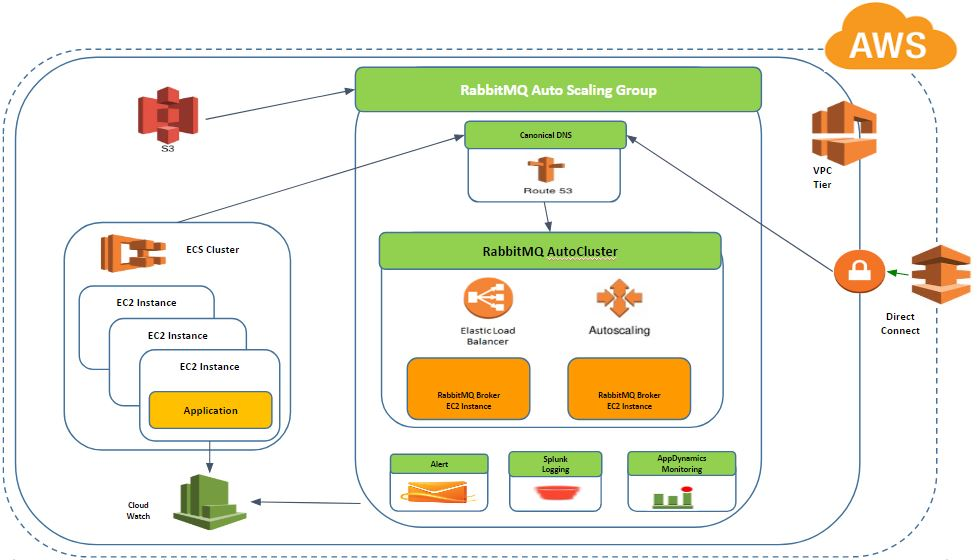
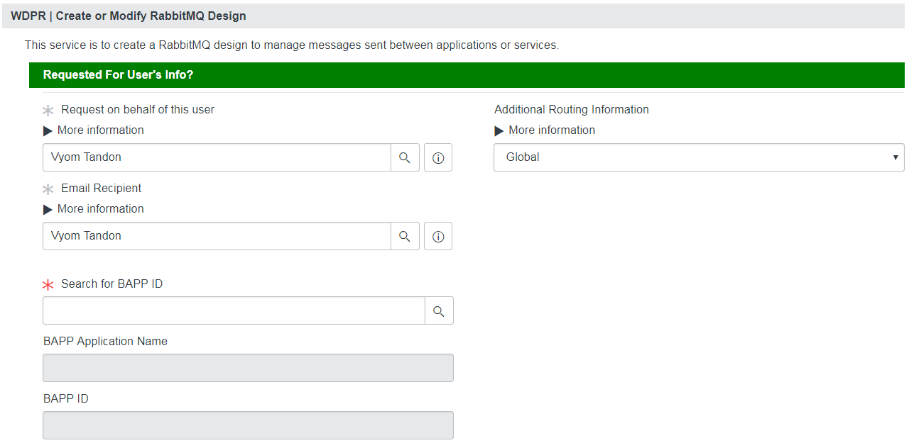
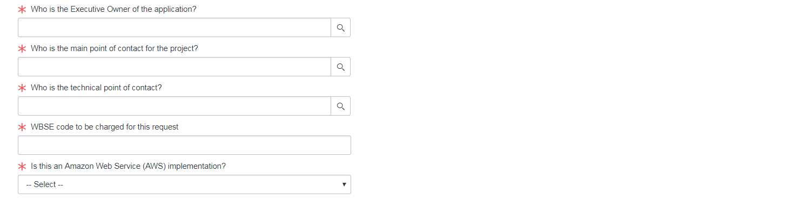
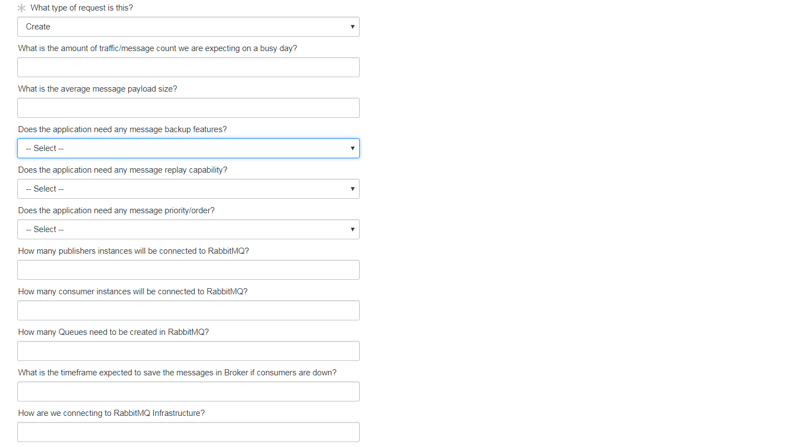
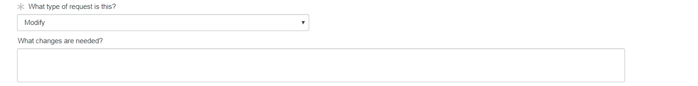
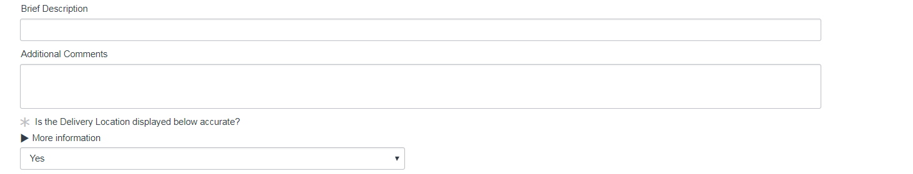

# WDPR Reference Architecture RabbitMQ Middleware Design

## Index
1. [RabbitMQ Overview](#1-rabbitmq-overview)
2. [WDPR RA RabbitMQ Enterprise Documentation Links](#2-wdpr-ra-rabbitmq-enterprise-documentation-links)
3. [WDPR RA RabbitMQ Deployment Strategy](#3-wdpr-ra-rabbitmq-deployment-strategy)
4. [Application Middleware On-boarding Design Guidelines](#4-application-middleware-on-boarding-design-guidelines)
5. [References](5-references)

## 1. RabbitMQ Overview
RabbitMQ is a MOM (Message Oriented Middleware), developed with Erlang (a TLC-oriented programming language) and implementing the wire protocol AMQP (Advanced Message Queuing Protocol). RabbitMQ is designed in such as way that the messages can be routed in complex ways to consumers, it guarantees per-message delivery, it provides Highly Available Queues at the cluster-node level.

- Exchange : The entity within the server which receives messages from producer applications and optionally routes these to message queues within the server
- Exchange type : The algorithm and implementation of a particular model of exchange. In contrast to the “exchange instance”, which is the entity that receives and routes messages within the server
- Message queue : A named entity that holds messages and forwards them to consumer applications
- Binding : An entity that creates a relationship between a message queue and an exchange
- Channel : A message channel is a logical channel in a messaging system. That is, sending messages to different message channels provides an elementary way of sorting messages into different message types. Message queues and message topics are examples of message channels.
- Routing key : A virtual address that an exchange may use to decide how to route a specific message.

## 2. WDPR RA RabbitMQ Enterprise Documentation Links

The section gives the quick links for the individual Developer Guides.

- WDPR RabbitMQ Installation
	- [WDPR RabbitMQ Auto Unix Installation Guide](https://github.disney.com/WDPR-RA/wdpr-ra-cloud-init-rabbitmq-cluster)
	- [WDPR RabbitMQ Docker Installation Guide](https://github.disney.com/WDPR-RA/wdpr-ra-docker-rabbitmq)
	- [WDPR RabbitMQ Manual Unix Installation Guide](https://github.disney.com/WDPR-RA/wdpr-ra-enterprise-rabbitmq/blob/develop/docs/wdpr-rabbitmq-manual-unix-installtion.md)
- [WDPR RabbitMQ AutoCluster Developers Guide](https://github.disney.com/WDPR-RA/wdpr-ra-enterprise-rabbitmq/blob/develop/docs/wdpr-rabbitmq-autocluster-developers-guide.md)
	- [RabbitMQ Autoclustering using Amazon AWS EC2 Tags](https://github.disney.com/WDPR-RA/wdpr-ra-enterprise-rabbitmq/blob/develop/docs/wdpr-rabbitmq-autocluster-aws-settings-guide.md)
	- [RabbitMQ Autoclustering using Amazon AWS Autoscaling Group Membership](https://github.disney.com/WDPR-RA/wdpr-ra-enterprise-rabbitmq/blob/develop/docs/wdpr-rabbitmq-autocluster-aws-settings-guide.md)
	- [RabbitMQ Autoclustering using Consul](https://github.disney.com/WDPR-RA/wdpr-ra-enterprise-rabbitmq/blob/develop/docs/wdpr-rabbitmq-autocluster-consul-settings-guide.md)
	- [RabbitMQ Autoclustering using A-Record based DNS Round-robins](https://github.disney.com/WDPR-RA/wdpr-ra-enterprise-rabbitmq/blob/develop/docs/wdpr-rabbitmq-autocluster-dns-settings-guide.md)
	- [RabbitMQ Autoclustering using etcd2](https://github.disney.com/WDPR-RA/wdpr-ra-enterprise-rabbitmq/blob/develop/docs/wdpr-rabbitmq-autocluster-etcd-settings-guide.md)
- [WDPR RabbitMQ Plugin Developers Guide](https://github.disney.com/WDPR-RA/wdpr-ra-enterprise-rabbitmq/blob/develop/docs/wdpr-rabbitmq-plugin-developers-guide.md)
- [WDPR RabbitMQ Monitoring Developers Guide](https://github.disney.com/WDPR-RA/wdpr-ra-appd-rabbitmq-ext)

## 3. WDPR RA RabbitMQ Deployment Strategy

RabbitMQ is available for both Cloud and On-Prem deployments.  

### 3.1 RabbitMQ Cloud Deployment Strategy

### 3.2 RabbitMQ On-Prem Deployment Strategy
- RabbitMQ should be installed using the [Chef Cook Book](https://github.com/rabbitmq/chef-cookbook)

### 3.3 RabbitMQ Windows Installation

- Follow the [RabbitMQ Windows Installation](https://www.rabbitmq.com/install-windows.html) like for more details.

## 4. Application Middleware On-boarding Design Guidelines

The applications which want to use the Middleware for aynschronous processing would have to on-board Reference Architecture Team to do the design and architect the middleware solution based on the application deployment needs for On-Prem or AWS.

Applications are expected to use the [RabbitMQ Design Catalog Link](https://disneyuat.service-now.com/nav_to.do?uri=%2Fcom.glideapp.servicecatalog_cat_item_view.do%3Fv%3D1%26sysparm_id%3D7521778cdb7d0740c536f3f7bf96199c%26sysparm_link_parent%3D0281bb8cdb7d0740c536f3f7bf9619e7%26sysparm_catalog%3De0d08b13c3330100c8b837659bba8fb4%26sysparm_catalog_view%3Dcatalog_default) to raise the middleware design and architecture request. 

### 4.1. Provide Application BAAPID.

### 4.2. Provide Application Details

### 4.3. Middleware Create Details 

### 4.4. Middleware Modify Details 

### 4.5. Middleware API Details 

### 4.5. Middleware Additional Details

## 5. References
1. [RabbitMQ Enterprise Link](https://www.rabbitmq.com/)
2. [RabbitMQ Management](https://www.rabbitmq.com/management.html)
3. [RabbitMQ Documentation](http://www.rabbitmq.com/documentation.html)
4. [RabbitMQ Server Documentation](http://www.rabbitmq.com/admin-guide.html)
5. [RabbitMQ Client Documentation](http://www.rabbitmq.com/clients.html)
6. [WDPR RA RabbitMQ Enterprise Documentation](https://github.disney.com/WDPR-RA/wdpr-ra-enterprise-rabbitmq)

