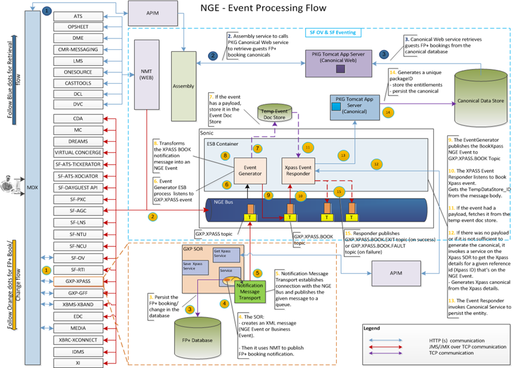
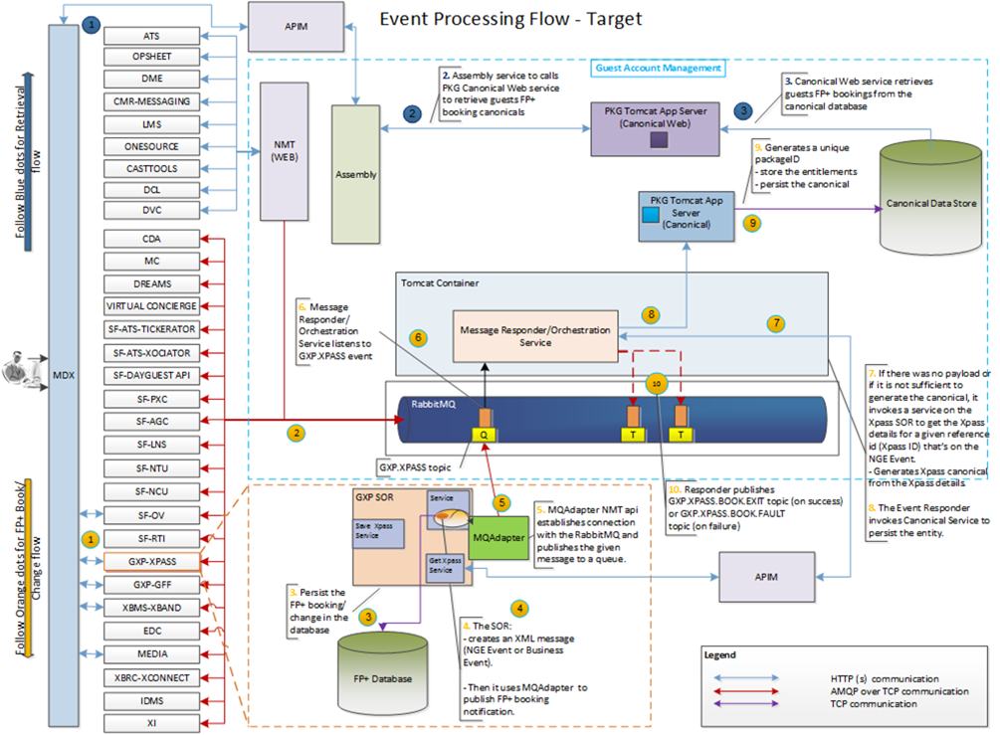
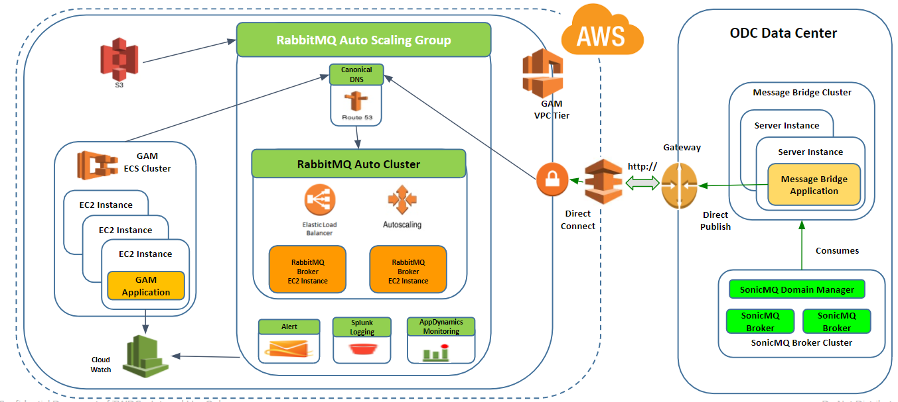
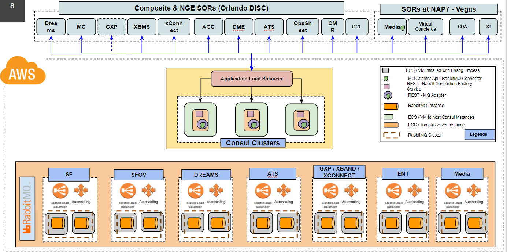

# WDPR RA RabbitMQ Middleware Design - MM+ Application

## Index
1. [Overview](1-overview)
2. [Middleware Scope](2-middleware-scope)
3. [MM+ Application Design Details](#3-mm+-application-design-details)
4. [References](#4-references)

## 1. Overview

- Project Mission: Redesign the technology foundation that supports MyMagic+ (MM+), address stability issues, and enable future growth.

- Project Alignment: This project aligns with three other independent projects: Magic Band Evolution, Business Rule Simplification, and Clean Runs.

- Project Goals: Improve Stability (99.5% availability), Reduce Data Issues (ex. door lock issues), Improve Scalability (scale for spikes and future growth), and Reduce Costs (sustainment and licensing)

## 2. Middleware Scope

- Activities
 - Refactor Eventing (RabbitMQ)
- Encompassed Systems
	- 12 SORs Adopting New Integration Points
		- Magical Express
		- ATS/Ticketing
		- OpSheet
		- Dreams
		- Cruise
		- SF Messaging
		- SF Level N
		- Magical Celebrations
		- Experience Insights
		- FastPass+
		- Media/Photopass
		- Magic Band Management

## 3. MM+ Application Design Details

### 3.1 NGE Current Middleware Setup & Scope

### 3.2 MM+ Target Middleware Setup & Scope

### 3.3 RabbitMQ proposed Middleware Setup & Scope

### 3.4 RabbitMQ Segment Integration Setup & Scope

## 4. References
1. [RabbitMQ Enterprise Link](https://www.rabbitmq.com/)
2. [RabbitMQ Management](https://www.rabbitmq.com/management.html)
3. [RabbitMQ Documentation](http://www.rabbitmq.com/documentation.html)
4. [RabbitMQ Server Documentation](http://www.rabbitmq.com/admin-guide.html)
5. [RabbitMQ Client Documentation](http://www.rabbitmq.com/clients.html)
4. [WDPR RA RabbitMQ Enterprise Documentation](https://github.disney.com/WDPR-RA/wdpr-ra-enterprise-rabbitmq)

